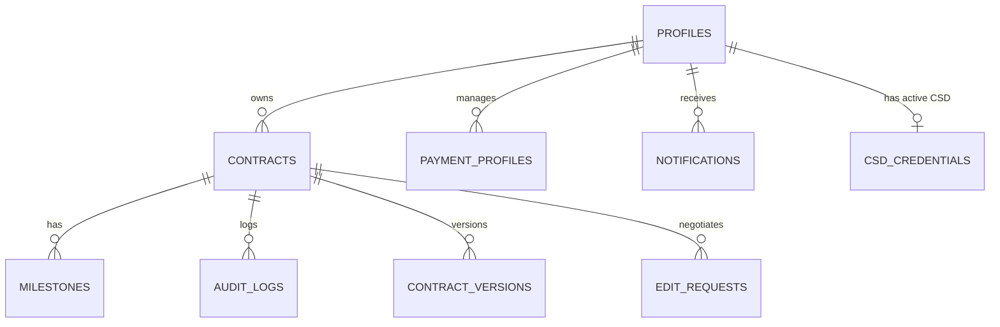

# Database Schema, RLS & Security Reference

This document covers the relational schema, Row-Level Security (RLS) access rules, storage assets, and security parameters of the database.

---

## 📊 Relational Database Schema

The database consists of nine core tables mapping profiles, digital agreements, tracking trails, and configurations. The primary keys are UUIDs (`crypto.randomUUID()` or `gen_random_uuid()`).

### 1. Table Definitions & Types

#### `public.profiles`
Stores freelancer identity, fiscal settings, tier plans, and banking setups.
*   `id` (UUID, PK): User identifier mapping to Supabase auth.
*   `email` (TEXT, Unique): Contact email.
*   `full_name` (TEXT): Legal or commercial name.
*   `rfc` (VARCHAR(13)): Mexican Tax ID.
*   `regimen_fiscal` (TEXT): Tax regime.
*   `codigo_postal` (VARCHAR(5)): Postal code.
*   `bank_details` (JSONB): Default bank info (`clabe`, `bankName`, `beneficiaryName`).
*   `tier` (TEXT): Subscription plan tier (`free`, `starter`, `pro`).
*   `phone` (TEXT): Notification phone number.

#### `public.contracts`
Primary agreement document tracking client details, scopes, statuses, and signatures.
*   `id` (TEXT, PK): Secure UUID string.
*   `freelancer_id` (UUID, FK): References `profiles(id)`.
*   `client_name` / `client_email` / `client_rfc` / `client_regimen` / `client_postal` / `client_cfdi_use` (TEXT): Client profile snapshot for invoicing.
*   `scope_description` (TEXT): Contract scope description.
*   `total_amount` (NUMERIC(12,2)) / `currency` (VARCHAR(3)): Financial details.
*   `status` (VARCHAR(20)): Current lifecycle state.
*   `contract_hash` (TEXT): SHA-256 integrity hash of draft clauses and details.
*   `pdf_url` (TEXT): Path to exported document.
*   `accepted_at` / `accepted_by_name` / `accepted_ip` (TIMESTAMP/TEXT): Client signing audit logs.
*   `freelancer_accepted_at` / `freelancer_accepted_by_name` / `freelancer_accepted_ip` (TIMESTAMP/TEXT): Freelancer sign-off vetting audit logs.
*   `client_otp_attempts` (INTEGER): Counter protecting signature.
*   `client_access_token` (TEXT): Secure token matching magic links.

#### `public.milestones`
Milestone lists mapping contract payment stages.
*   `id` (TEXT, PK): Secure UUID.
*   `contract_id` (TEXT, FK): References `contracts(id)`.
*   `label` (TEXT): Stage description (e.g. "Anticipo").
*   `amount` (NUMERIC(12,2)): Value of milestone.
*   `dueDate` (DATE): Target settlement date.
*   `status` (VARCHAR(20)): `pending`, `requested`, `marked_paid`, `confirmed`.
*   `markedPaidAt` / `confirmedAt` (TIMESTAMP): Event timestamps.
*   `trackingReference` (TEXT): SPEI tracking reference.
*   `receiptUrl` (TEXT): URL to uploaded receipt.
*   `exchangeRate` / `mxnAmount` (NUMERIC): USD exchange parameters.
*   `cfdi_status` (VARCHAR): `none`, `pending_csd`, `pending_invoice`, `issued`.
*   `cfdi_id` / `cfdi_xml_url` / `cfdi_pdf_url` (TEXT): Invoice artifacts.

#### `public.csd_credentials`
Stores encrypted CSD (Certificado de Sello Digital) credentials for CFDI 4.0 generation via Facturapi.
*   `id` (UUID, PK)
*   `freelancer_id` (UUID, FK, Unique constraint if active): References `profiles(id)`.
*   `encrypted_cer` / `encrypted_key` / `encrypted_password` (TEXT): AES-256-GCM encrypted values.
*   `iv` (TEXT): Initialization vector for decryption.
*   `rfc` (TEXT): Freelancer's RFC extracted from the certificate.
*   `is_active` (BOOLEAN): Identifies the currently active CSD (1-to-1).
*   `created_at` (TIMESTAMP)

#### `public.audit_logs`
Chronological activity tracker for contract events.
*   `id` (UUID, PK): Identifier.
*   `contract_id` (TEXT, FK): References `contracts(id)`.
*   `action` (TEXT): Event description key (e.g., `client_signed`).
*   `actor` (TEXT): Actor role (`freelancer`, `client`, `system`).
*   `details` (TEXT): Detailed event log.
*   `timestamp` (TIMESTAMP): Execution time.
*   `ip` (TEXT): Actor IP address.

#### `public.contract_versions`
Stores historical versions of contract total amounts, scopes, and taxes on renegotiations.
*   `id` (UUID, PK) / `contract_id` (TEXT, FK)
*   `versionNumber` (INTEGER): Sequential version ID.
*   `scope_description` / `total_amount` / `currency` / `subtotalAmount` / `ivaAmount` / `taxWithholdingAmount` (TEXT/NUMERIC): Scope snapshot at modified time.
*   `reason` (TEXT): Change explanation.

---

## 🔒 Row-Level Security (RLS) Policies

Row-Level Security is strictly enabled on the database schema. Client requests (anon token) are scoped dynamically, and freelancer requests are scoped to their active authenticated session.

| Table | Operation | Target Role | Security Filter Condition / Check |
| :--- | :--- | :--- | :--- |
| **`profiles`** | SELECT | `anon` | Enabled only if `id` belongs to a freelancer who owns an active, non-draft contract. |
| | ALL | `authenticated` | `auth.uid() = id` (User manages only their profile). |
| **`contracts`** | SELECT | `anon` | `status != 'draft'` (Clients can view active sent agreements). |
| | UPDATE | `anon` | `status = 'sent'` (Clients can only sign/update during review state). |
| | ALL | `authenticated` | `auth.uid() = freelancer_id` (Freelancers manage own files). |
| **`milestones`** | SELECT | `anon` | Allowed if parent contract is `status != 'draft'`. |
| | UPDATE | `anon` | `status = 'requested'` with check `status = 'marked_paid'` (Clients notify payments). |
| | ALL | `authenticated` | Scope matches active contract owner (`freelancer_id = auth.uid()`). |
| **`audit_logs`** | SELECT | `anon` | Allowed if parent contract is `status != 'draft'`. |
| | INSERT | `anon` | Checks if parent contract status is in `('sent', 'client_signed', 'accepted', 'completed')`. |
| | SELECT | `authenticated` | Active freelancer must own the contract referenced in audit log. |
| **`rate_limits`** | ALL | `anon`, `auth` | Open policies allowing rate-limit check increments. |

---

## 📂 Storage Bucket Rules: `receipts`

SPEI payment receipt uploads are hosted inside a Supabase Storage bucket called `receipts`.

### 1. Storage Access Policies
*   **Public Access**: Read permission (`SELECT`) is public, allowing visual proof links.
*   **Upload Permission**: Restricted to authenticated freelancers and anonymous client uploads matching receipt formats.

### 2. Upload Sanitization & Checks
To protect the database and application environment from malicious uploads (malware, shell scripts, or executable payloads), all uploads must pass a validation check:
1.  **File Size Limit**: Files cannot exceed **5MB**.
2.  **MIME-type Whitelist**: Only `application/pdf`, `image/png`, `image/jpeg`, and `image/jpg` are allowed.
3.  **Magic Bytes Check**: The file header bytes are inspected to verify they match the reported file extension:
    *   **PDF**: Must begin with `%PDF` (`25 50 44 46` in hex).
    *   **PNG**: Must begin with PNG header (`89 50 4E 47 0D 0A 1A 0A` in hex).
    *   **JPEG/JPG**: Must begin with JPEG SOI (`FF D8 FF` in hex).

---

## ⚡ Rate Limiting & Brute Force Controls

To prevent denial-of-service and brute force bypasses on sign-off, public API endpoints are throttled using the `public.rate_limits` table:
*   **OTP Generation**: Capped at 5 requests per 10 minutes per IP address.
*   **OTP Verification Checks**: Locked after **3 failed verification attempts** on a contract to block brute-force guessing of the 6-digit code.
