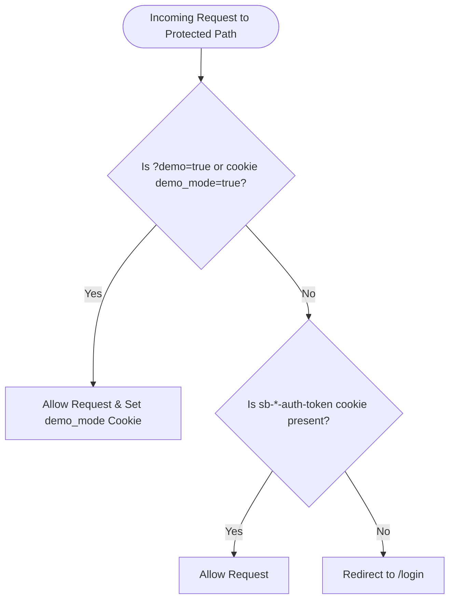

# Developer Lifecycle, Routing & SaaS Flows

This document serves as an onboarding guide for Software Engineers setting up their local workspace, running test validation gates, and understanding runtime routing, billing tiers, and notifications.

---

## 💻 Local Setup & Environment Variables

The project runs in either a local mock mode (file-based database) or a cloud-connected mode (Supabase). 

### 1. Environment Configurations
To configure the application, create a `.env.local` file in the root directory:

```bash
# App Configuration
NEXT_PUBLIC_APP_URL=http://localhost:3000

# Supabase Public Keys (Required for Cloud Database mode)
NEXT_PUBLIC_SUPABASE_URL=https://your-project-id.supabase.co
NEXT_PUBLIC_SUPABASE_ANON_KEY=eyJhbGciOiJIUzI1NiIsInR5cCI6IkpXVCJ9...

# Supabase Service Role Key (Required for Cron reminders)
SUPABASE_SERVICE_ROLE_KEY=eyJhbGciOiJIUzI1NiIsInR5cCI6IkpXVCJ9...
```

### 2. Development Workflow Commands
*   **Start Local Dev Server**: `npm run dev` (Spins up Next.js on `http://localhost:3000`).
*   **Compile & Lint Checks**: `npm run pretest` (Executes both typechecking and ESLint style-validation).
*   **Run Unit Tests**: `npm run test` (Runs native V8 tests and checks code coverage threshold).
*   **Setup Mock Test Database**: `node scripts/setup-test-db.js` (Creates and seeds a local schema in PostgreSQL container).
*   **Run E2E Integration Suite**: `npx playwright test` (Launches E2E browser automation scripts).

---

## 🔒 Route Protection & Middleware Routing

Access control for core workspace pages is enforced client-side and at the server boundary using [middleware.ts](file:///Users/jhzamora/contract-tracker/middleware.ts).

### 1. Protected Paths
The middleware matches the following routes:
*   `/dashboard/:path*` (Freelancer Dashboard)
*   `/contracts/:path*` (Contract wizard and detail views)
*   `/admin/:path*` (Financial analytics center)
*   `/onboarding/:path*` (Fiscal setup page)

### 2. Guard Interception Logic
For any request hitting a protected path, the middleware applies the following sequence:



---

## 💳 SaaS Tier Billing & Feature Gating

The application supports three plans (`free`, `starter`, `pro`) which are checked dynamically at the UI and business layers:

### 1. Subscription Matrix & Guard Rules

| Feature / Limit | Free Plan | Starter Plan | Pro Plan |
| :--- | :--- | :--- | :--- |
| **Contract Creation Cap** | **Max 3 Contracts** | **Max 10 Contracts** | **Unlimited** |
| **Custom Branding Uploads** | ❌ Locked (Files stripped) | ✅ Unlocked (2MB cap) | ✅ Unlocked (2MB cap) |
| **Premium Templates** | ❌ Basic Only | ✅ All templates | ✅ All templates |

### 2. Enforcement Implementations
*   **Contract Cap**: Enforced in [new/page.tsx](file:///Users/jhzamora/contract-tracker/app/contracts/new/page.tsx#L301-L320). If `profile.tier === 'free'` and total contract count is $\ge 3$, the wizard is blocked, rendering a "Plan Limit Reached" screen.
*   **Branding Stripping**: Enforced on onboarding and settings updates. If `profile.tier === 'free'`, the `logoUrl` and `signatureUrl` properties are overwritten to `undefined` during submission.

---

## ✉️ Notifications & Background Workers

### 1. Automated Cron Reminders
To prompt clients for payments approaching their due dates:
*   **Worker URL**: `GET /api/cron/reminders` (Hired daily by external trigger like Vercel Cron or GitHub Actions).
*   **Logic**:
    1.  Queries all active contracts (`status === 'accepted'`).
    2.  For each contract, checks pending or requested milestones.
    3.  If a milestone's `dueDate` is exactly **3 days away**, it compiles a secure magic URL link.
    4.  Dispatches a reminder email to `contract.clientEmail` using Resend.
    5.  Appends an entry in the contract's `audit_logs` tracking the automated event.

### 2. Transactional Email Dispatches
All status-change transactional emails are simulated or sent using `lib/emails.ts` and `/api/send-email`:
*   **Client Invites**: Sent when contract status shifts from `draft` to `sent` to notify the client to sign.
*   **Payment Confirmations**: Fired when a freelancer seals a milestone as `confirmed`.

### 3. WhatsApp Click-to-Chat Templates
For quick interactions, the Freelancer Alerts Center compiles contextual templates for status transitions:
*   **Template Builder**: Forms a `wa.me` URL string containing URL-encoded Mexican pre-written messages:
    *   *Example URL format*: `https://wa.me/521[phone]?text=Hola%20[client],%20te%20comparto%20el%20hito...`
*   **State-Linked Actions**: Allows freelancers to tap one button to instantly trigger a formatted WhatsApp chat request for Proposal Sent, Milestone Requested, and Payment Received.
