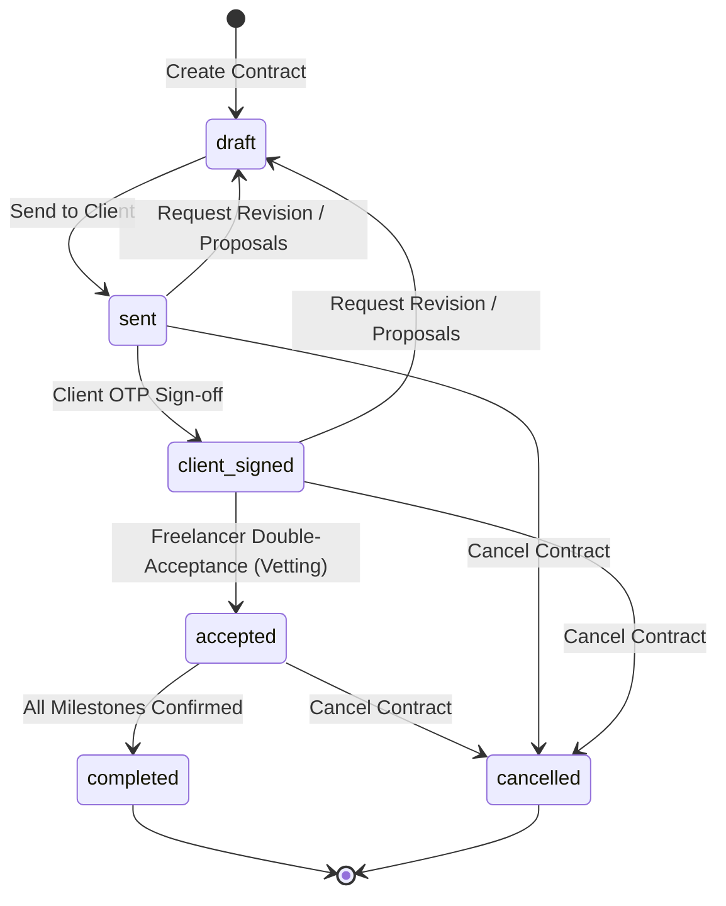
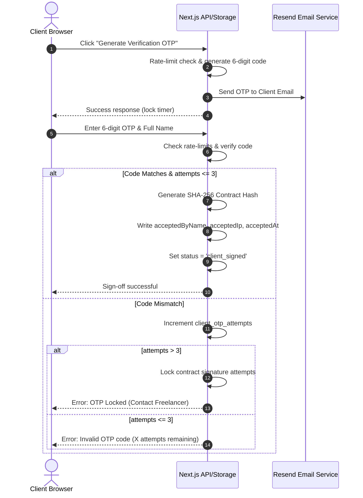
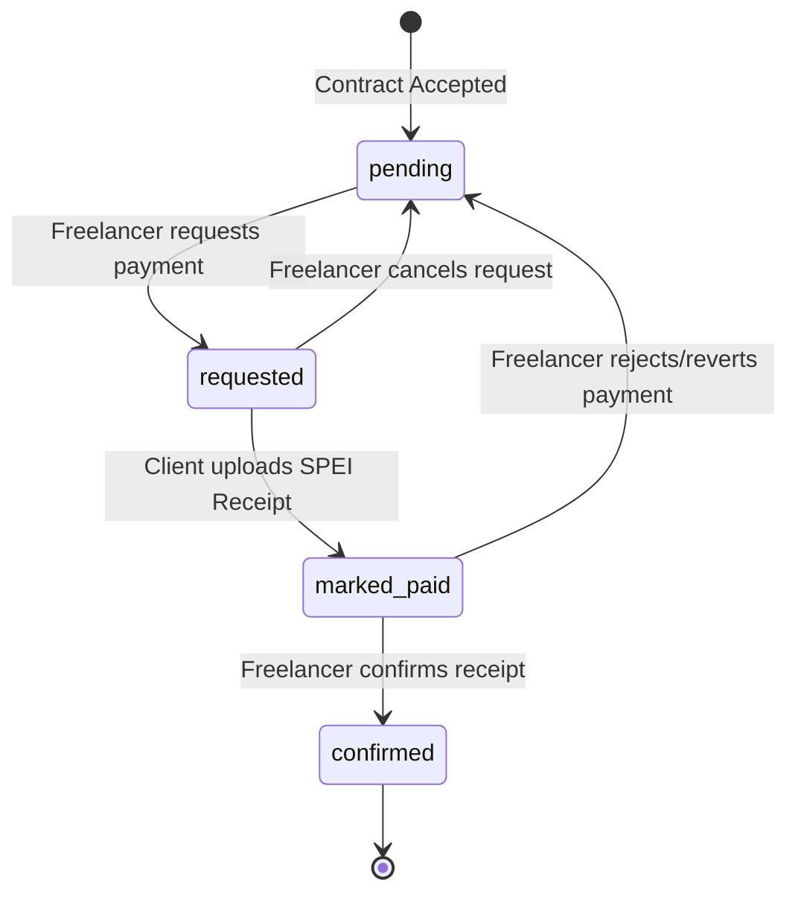

# Contract & Milestone State Machine Reference

The Contract & Payment Tracker implements formal, deterministic state machines to control the lifecycles of contracts and payment milestones. These state machines prevent out-of-order execution, secure agreements, and protect transaction records.

---

## 📜 Contract State Machine

Contracts move through a strict chronological progression. Every state transition is audited and validated at both the UI and database/storage layer.

### 1. Valid Contract Transitions Matrix

| From State \ To State | `draft` | `sent` | `client_signed` | `accepted` | `completed` | `cancelled` |
| :--- | :---: | :---: | :---: | :---: | :---: | :---: |
| **`draft`** | - | ✅ | ❌ | ❌ | ❌ | ❌ |
| **`sent`** | ✅ (Revision) | - | ✅ (OTP Sign) | ❌ | ❌ | ✅ |
| **`client_signed`** | ✅ (Revision) | ✅ | - | ✅ (Vet OK) | ❌ | ✅ |
| **`accepted`** | ✅ (Reset) | ❌ | ❌ | - | ✅ (Paid) | ✅ |
| **`completed`** | ❌ | ❌ | ❌ | ❌ | - | ❌ |
| **`cancelled`** | ❌ | ❌ | ❌ | ❌ | - | - |

---

## 🔒 State Guard Implementations & Rules

To maintain agreement integrity, several runtime state guards are enforced:

### 1. Locked Amendments in Active States
Once a contract enters `sent`, `client_signed`, `accepted`, or `completed`, the scope description, clauses, tax settings, and milestone splits are locked. No direct edits are allowed. Any renegotiation must be requested via a **Revision Proposal**, which reverts the status to `draft` and logs a historical version changeset.

### 2. Proportional Milestone Scaling
When editing a contract in `draft` mode, if the total amount is modified, the system automatically runs proportional scaling to adjust the milestone amounts so they sum exactly to the new total contract value, preserving the percentage splits.

### 3. Double-Acceptance (Freelancer Vetting)
Unlike traditional signing where the sender signs first, this workflow uses a **Double-Acceptance Vetting Sequence**:
1.  Freelancer writes the draft and submits it to the client (status `sent`).
2.  Client reviews the contract details, performs OTP authentication, and signs (status `client_signed`).
3.  Freelancer reviews the client's submitted details and provides final double-acceptance vetting to legally seal the agreement (status `accepted`).

---

## 🔑 Secure Client Signing & OTP Flow

Clients do not need to create accounts. They are sent secure magic links (`/c/[id]?token=...`). The client signing flow uses a **One-Time Password (OTP)** verification process combined with a cryptographic hash seal:

---

## 💸 Milestone State Machine

Individual payment milestones operate under a sub-lifecycle tracking payment collections, receipt uploads, and confirmation:

### 1. Milestone States & Transitions
*   **`pending`**: Default state when a contract is accepted.
*   **`requested`**: Freelancer triggers payment collection. The client is notified via email/WhatsApp.
*   **`marked_paid`**: Client transfers funds via SPEI and uploads a payment receipt (e.g. PDF/Image).
*   **`confirmed`**: Freelancer verifies the transfer settled in their bank account and seals the milestone as paid.

### 2. Milestone Reversion Control
Freelancers can reject invalid payment notices by reverting a milestone from `marked_paid` back to `pending`. This deletes the linked payment receipt from storage, logs the reversion in the contract audit logs, and allows the client to report the transfer again with corrected details.
