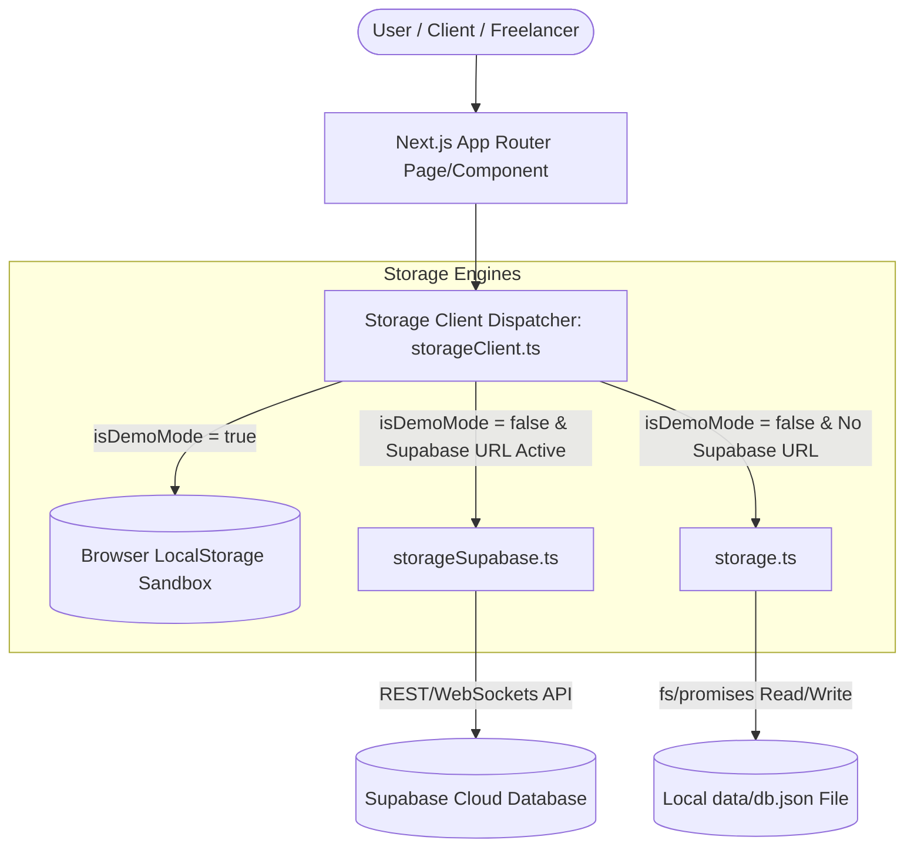

# System Architecture & Technical Design Reference

Welcome to the central system architecture and technical design documentation for the **Mi Pacto (MX)**. This document serves as the entry point for understanding the codebase, its components, state machines, database structures, and Mexican tax integrations. Use this guide to plan new features, refactor components, and prevent regressions.

---

## 🛠️ Technology Stack

The project is built on a modern TypeScript web stack:

*   **Frontend Framework**: [Next.js](https://nextjs.org) (v16.2.10) with React (v19.2.4) utilizing the App Router.
*   **Styling**: [Tailwind CSS](https://tailwindcss.com) (v4) with CSS variables and PostCSS styling overrides.
*   **Database & Auth**: [Supabase](https://supabase.com) via `@supabase/supabase-js` (v2.110.2).
*   **Icons**: [Lucide React](https://lucide.dev) (v1.24.0) for iconography.
*   **Testing Suite**: Node.js Native Test Runner (with V8 coverage) for unit tests, and [Playwright](https://playwright.dev) (v1.61.1) for end-to-end integration tests.

---

## 🏗️ High-Level Architecture

The application implements a hybrid model to support a zero-install browser sandbox (Demo/Sandbox Mode), a local server-side mock database, and a full cloud Supabase backend. The routing and persistence layer are decoupled through a dispatching client.



---

## 📁 Directory Structure & Key Files

Here is a map of the repository's core directory structure:

```
├── app/                      # Next.js App Router root
│   ├── admin/                # Freelancer admin metrics and ticker center
│   ├── api/                  # Server-side endpoints (reminders, emails, Stripe webhooks)
│   ├── c/                    # [id] Secure client portal view & OTP sign-off
│   ├── components/           # Decomposed UI component library
│   │   ├── ui/               # Atomic primitives (Button, Badge, Card, Input, etc.)
│   │   ├── wizard/           # Contract creation wizard steps (TemplateGallery, etc.)
│   │   ├── client/           # Client portal components (SigningFlow, PaymentUpload, etc.)
│   │   ├── modals/           # Extracted modal dialogs (Payment, Revision, Resend, Edit)
│   │   ├── AppShell.tsx      # Layout wrapper: sidebar + header + main content
│   │   ├── Sidebar.tsx       # Desktop navigation with brand, links, and user profile
│   │   ├── BottomNav.tsx     # Mobile-only fixed bottom tab bar
│   │   ├── ContractPipeline.tsx  # Kanban board with snap-scroll columns
│   │   ├── ContractCard.tsx  # Pipeline card: client, amount, status, overflow menu
│   │   ├── ContractDetail.tsx    # Tabbed slide-over panel for contract management
│   │   ├── ContractListView.tsx  # Sortable table alternative to the Kanban board
│   │   ├── MoneyCard.tsx     # Financial summary card (Cobrado, Pendiente, etc.)
│   │   ├── MilestoneTimeline.tsx # Vertical timeline with status dots and CTAs
│   │   ├── AuditTimeline.tsx # Chronological event log with action icons
│   │   ├── TaxBreakdown.tsx  # Collapsible fiscal ISR/IVA summary
│   │   ├── NotificationBell.tsx  # Header dropdown notification panel
│   │   └── UpgradeAlert.tsx  # Tier-limit upgrade banner
│   ├── hooks/                # Extracted state management hooks
│   │   ├── useContracts.ts   # Contract CRUD, filtering, and search
│   │   ├── useMilestones.ts  # Milestone state transitions and receipt linking
│   │   ├── useProfile.ts     # Profile data, tier info, demo mode detection
│   │   ├── useFinancialStats.ts  # Memoized computed financial statistics
│   │   └── useContractWizard.ts  # Wizard form state (all steps in one hook)
│   ├── contracts/            # Freelancer contract wizard creation views
│   ├── dashboard/            # Freelancer dashboard workspace (~250 lines orchestrator)
│   ├── hash-verifier/        # Copy-paste contract hash verification interface
│   ├── login/ / register/    # Authentication pages
│   ├── notifications/        # Full notification history view
│   ├── onboarding/           # Pricing tier and fiscal profile onboarding wizard
│   ├── plans/                # Stripe checkout for tier upgrades
│   ├── layout.tsx / page.tsx # Core layout and landing pages
│   └── ApiKeyGuard.tsx       # Supabase configuration verification wrapper
├── design_docs/              # Architecture, PRD, roadmap, and design system documentation
├── emails/                   # React Email templates (OTP, Invitations)
├── lib/                      # Business logic, validators, and database clients
│   ├── emails.ts             # React Email & Resend transactional dispatchers (w/ local fallback)
│   ├── mockData.ts           # Demo mode and database seeding data
│   ├── rfcValidator.ts       # Mexican RFC parser and Modulo 11 check digit validator
│   ├── storage.ts            # Server-side file-based database actions (db.json)
│   ├── storageClient.ts      # Multi-tenant storage dispatcher & sandbox engine
│   ├── storageSupabase.ts    # Supabase cloud adapter and database actions
│   ├── supabaseClient.ts     # Client initialization for Supabase auth/storage
│   └── types.ts              # TypeScript type interfaces (Contract, Milestone, etc.)
├── scripts/                  # Test automation, database setups, and coverage runners
│   ├── test-runner.js        # TS compiler wrapper and V8 coverage gate check
│   └── setup-test-db.js      # Sandbox DB initialization and migration seed
├── supabase/                 # Database migrations and CLI configurations
│   └── migrations/           # SQL schema migrations (00000000000000 -> 2026...)
└── tests/                    # End-to-End browser tests (Playwright)
```

---

## 📖 Sub-System Documentation

The architecture is divided into the following dedicated sub-documents:

### 1. 🗄️ [Dual-Storage Engine Design](file:///Users/jhzamora/.gemini/antigravity-ide/scratch/mi-pacto/design_docs/architecture-dual-storage.md)
Detailed document on how the storage client routes database calls between LocalStorage, file-based JSON storage, and Cloud Supabase, as well as how Sandbox Mode functions.

### 2. 🔄 [State Machines & Agreement Flow](file:///Users/jhzamora/.gemini/antigravity-ide/scratch/mi-pacto/design_docs/architecture-state-machine.md)
Defines the strict transitions of the contract lifecycle (`draft` ➡️ `sent` ➡️ `client_signed` ➡️ `accepted` ➡️ `completed`), the OTP identity verification flow for clients, and milestone tracking.

### 3. 🇲🇽 [Mexican Localization & Integrations](file:///Users/jhzamora/.gemini/antigravity-ide/scratch/mi-pacto/design_docs/architecture-mexican-localization.md)
Documents the Mexican taxpayer validation (RFC Modulo 11 algorithm), withholding tax calculations (RESICO IVA/ISR), Banxico SPEI reconciliation, and USD/MXN exchange tracking.

### 4. 📊 [Database Schema, RLS & Security](file:///Users/jhzamora/.gemini/antigravity-ide/scratch/mi-pacto/design_docs/architecture-data-model.md)
A technical reference of the relational tables, version control structures, Row-Level Security (RLS) policies, rate-limiting rules, and safe file upload sanitizations.

### 5. 💻 [Developer Lifecycle, Routing & SaaS Flows](file:///Users/jhzamora/.gemini/antigravity-ide/scratch/mi-pacto/design_docs/architecture-dev-lifecycle-flows.md)
An onboarding guide covering environment variables, setup commands, routing middleware protection, SaaS billing plan limits, and email/WhatsApp notification workers.

### 6. 🎨 [UX/UI Design System](file:///Users/jhzamora/.gemini/antigravity-ide/scratch/mi-pacto/design_docs/ux-ui-design-system.md)
The single source of truth for all UI work: design tokens, component library, screen specs, interaction & motion specs, design rationale, mobile strategy, and accessibility standards. Created during the P0 UX Sprint.

---

## 🛡️ Core Security Architecture

*   **Row-Level Security (RLS)**: Every table has RLS enabled. Authenticated freelancers can only view, edit, or delete items where `freelancer_id` matches their auth session. Anonymous clients can only access non-draft records matching their explicit view parameters.
*   **XSS Protection**: Inputs are sanitized before database insertion and rendering (stripping HTML tags like `<script>`).
*   **Brute-Force OTP Lockout**: Clients signing contracts are capped at 3 verification attempts. After the threshold, the OTP session is locked to prevent credential stuffing.
*   **Upload Security**: Payment receipts uploaded to the storage bucket must be under 5MB and pass both MIME-type whitelist checks and magic byte header validations.
*   **API Throttling**: Public endpoints (OTP generation, signing, payment notifications) are protected by IP and action rate limiters.

---

## 🧪 Testing & Code Quality Gates

The codebase enforces strict requirements to prevent regressions:

1.  **Husky Pre-commit Hooks**: Automatically run `npm run lint` and unit checks on git commit.
2.  **Lint Enforcement**: ESLint checks are run with zero-warning tolerances (`--max-warnings=0`) across both development and CI/CD pipelines.
3.  **Unit Tests & Coverage**: Node.js native test runner verifies tax calculators, validators, and input sanitizers. Code coverage must meet a minimum threshold of **85%** for lines and branches before commits can be completed.
4.  **E2E Parallel Testing**: Playwright runs automated tests in parallel using test retries and trace-captures to isolate flakiness.
