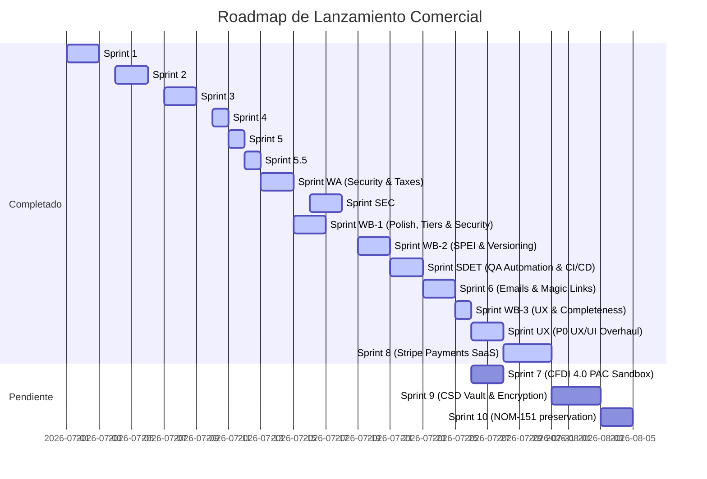

# Project Feature & Sprint Roadmap

This document outlines the full roadmap for the Freelancer Contract & Payment Tracker, mapping accomplished sprints, retroactive workback plans for gaps, and scheduled future phases.

---

## 🗺️ Sprint Timeline & Status

---

## 📋 Sprint Index

### 🟢 Sprint 1: Cimientos y Búsqueda (Completado)
* **Wizard Templates**: Formularios dinámicos para redactar contratos en pasos.
* **Dashboard Search**: Barra de búsqueda interactiva y filtros por estado de contrato (`borrador`, `enviado`, `aceptado`, `completado`, `atrasado`).

### 🟢 Sprint 2: Firma Expresa y Sello de Confianza (Completado)
* **Double Acceptance**: Firma de aceptación con casilla de confirmación digital.
* **Audit Trail**: Registro cronológico de actividades del contrato.
* **Legal Cryptographic Seal**: Generación de huella hash SHA-256 única por contrato.

### 🟢 Sprint 3: Operaciones y Impresión (Completado)
* **Print Style Overrides**: Formato CSS adaptado para PDF.
* **Receipt Attachments**: Carga de comprobantes de pago SPEI en hitos individuales.
* **Milestone Reverts**: Reversión de estados de hito de reportados a pendientes.

### 🟢 Sprint 4: Marca y Panel de Administración (Completado)
* **Branding**: Carga y renderizado de Logotipo y Firma digital del freelancer.
* **Visual Diff Viewer**: Comparador de alcance original vs. nueva propuesta.
* **Admin Dashboard**: Consola con métricas de volumen financiero y tickers.

### 🟢 Sprint 5: Autenticación y Multi-inquilino (Completado)
* **Auth Forms**: Vistas `/login` y `/register` integradas con Supabase.
* **Onboarding**: Wizard fiscal para nuevos registros.
* **Route Protection**: Middleware que protege `/dashboard` y sub-rutas.
* **User Scoping**: Scoping de base de datos Supabase por el ID del usuario activo.
* **E2E Playwright Testing**: Pruebas de navegación automáticas locales y en CI/CD.

### 🟢 Sprint 5.5: Ajustes de Usabilidad (Completado)
* **Clickable Dashboard Templates**: Accesos rápidos desde el Panel de Control a plantillas con parámetros URL.
* **Granular Milestone Editing**: Edición individual de importes de hito con recalculo de total.
* **Mock Data Seeding**: Botón de carga de datos demo para cuentas nuevas.
* **Layout Polish**: Unificación visual del formulario de creación.

### 🟢 Sprint WA: Seguridad de Firma y Retenciones de Impuestos (Completado y QA Verificado)
* **Mexican Tax Estimator**: Dynamic calculation for Mexican tax withholdings (*Retenciones de ISR/IVA*) inside the contract creation wizard for physical-to-moral corporate transactions.
* **RFC Taxpayer Verification**: Form formatting checks, regex formats, and Modulo 11 check digit validations during onboarding and contract creation.
* **Signature Identity Verification (OTP)**: Secure 6-digit One-Time Password verification on client sign-off flows to legally bind signatures.

---

## 📋 Future Sprints & SaaS Launches

### 🟢 Sprint WB-1: Pulido, Planes y Seguridad (Completado)
* **Persistent Demo Mode**: Add client-side cookies and storage checks to allow full app access and creation in Demo mode without URL parameter loss.
* **Onboarding Funnel & Tier Caps**: Insert a plan selection interface in the onboarding flow. Cap Free tier users to 3 contracts and disable custom branding uploads.
* **API Key Browser Detection**: Decode anon key JWTs to verify if `service_role` was used. Catch Supabase key errors to render troubleshooting panels.
* **Unique Contract IDs**: Migrate contract and milestone ID generation to cryptographically secure UUIDs (`crypto.randomUUID()`).
* **Sealed Revisions**: Introduce a revision request flow returning the contract status back to `draft` with audit logs.
* **Print PDF Styles**: Hide web layout buttons and frame margins, styling the printable contract with proper indentation and signature columns.
* **Sequential State Machines**: Add validation checks on transitions. Enforce both-party agreement on payments.
* **Hash Verifier UI**: Add a verification view `/hash-verifier` to compute and check contract SHA-256 values.

### 🟢 Sprint SEC: Auditoría y Endurecimiento de Seguridad (Completado)
* **Supabase RLS Audit**: Audit all tables and enable Row-Level Security (RLS) strictly scoping data queries to the active freelancer's authenticated session.
* **API Rate Limiting**: Apply endpoint throttling on sensitive public APIs (OTP generation, contract signing, and milestone payment reporting).
* **OTP Verification Guard**: Enforce a maximum threshold of 3 OTP entry failures per signing attempt before locking verification.
* **Safe File Uploads**: Sanitize milestone receipt uploads. Enforce file size limits (5MB), mimetype whitelist checks, and magic bytes verification.
* **XSS Sanitization**: Prevent cross-site scripting (XSS) by cleaning contract descriptions, terms, and user inputs before DB insertion or HTML rendering.

### 🟢 Sprint WB-2: Reconciliación Automatizada y Historial de Cambios (Completado)
* **Banexcel SPEI Reconciliation**: Integrate automatic check for Comprobantes de Pago Electrónicos (*CEP*) using Banco de México's API (verifying tracking codes, amounts, and settlement).
* **Multi-Currency FX Tracker**: Add support for USD contracts with actual Exchange Rate (*Tipo de Cambio*) logging fields on SPEI payment uploads.
* **Freelancer Activity & Alerts Center**: Add a dashboard alerts feed to see real-time updates (client signs, revision requested, milestone payment uploaded). Integrate WhatsApp quick-action share buttons directly into alert items.
* **Contract Change Versioning**: Build a `contract_versions` table in Supabase to maintain full history of visual diff modifications during renegotiation.
  * Add exportable PDF log button for the contract audit logs.

### 🟢 Sprint SDET: Robust QA Automation & CI/CD Alignment (Completado)
* **Comprehensive Lint Coverage**: Enforce `eslint .` across the entire project (including tests, scripts, and database hooks) in both local development scripts and CI/CD pipelines to prevent type safety or style regressions.
* **E2E Parallel Execution & Flakiness Isolation**: Configure Playwright to run tests in parallel, optimize resources, and set up test retry behaviors and tracing/screenshot reports in CI/CD.
* **Pre-commit Git Hooks (Husky)**: Integrate Husky to automatically run lint and fast unit checks (`npm run lint` and unit test runner) locally on git commit, block commits with syntax/type errors, and verify format check parity with the remote CI gate.
* **Supabase Test Environment Seeding**: Create a pipeline-friendly test seeding script that spins up a mock Postgres schema, applies migrations, and seeds test-authenticated users to verify true database integration (RLS validation) in a staging environment.
* **Unified Coverage Reports**: Integrate LCOV coverage metrics for unit tests and track test suite assertions to maintain at least 85% coverage on tax calculators, validators, and security wrappers.

### 🟢 Sprint 6: Notificaciones WhatsApp, Correos Transaccionales y Enlaces Mágicos (Completado)
* **WhatsApp Status Notifications**: Capture freelancer `phone` and client `client_phone`. Construct unique contextual Click-to-Chat WhatsApp links (`wa.me`) for key contract and milestone state transitions (Proposal Sent, Client Signed, Accepted/Sealed, Milestone Requested, Payment Proof Uploaded, Payment Confirmed, Revision Proposed).
* **React Email & Resend**: Templates setup for client invitations and contract changes.
* **Client Access Tokens**: Secure, passwordless magic links (`/c/[id]?token=...`) so clients can review and sign without creating an account.
* **Cron Reminders**: Daily triggers for milestones approaching their due dates.

### 🟢 Sprint WB-3: UX & Document Completeness (Completado)
* **Contract State Machine Enforcement**: Enforced strict state transitions (`draft → sent → client_signed → accepted → completed/cancelled`) at both UI and server/storage layers.
* **Branding File Upload**: Replaced company logo and signature text fields with file pickers supporting 2MB limits and previews.
* **Payment Profiles CRUD UI**: Integrated a full management panel in dashboard settings to configure, edit, delete, and set default bank profiles.
* **Standing Trust Element**: Added a verified status indicator card in the client contract view.
* **Standalone Documents Archive**: Created a standalone route `/documents` to filter, search, and view all digital contracts, CEP receipts, and audit logs.

### 🟢 Sprint UX: P0 UX/UI Overhaul (Completado)
> **Design System Document:** [`design_docs/ux-ui-design-system.md`](file:///Users/jhzamora/.gemini/antigravity-ide/scratch/contract-tracker/design_docs/ux-ui-design-system.md)

A dedicated UX sprint that paused feature work to rebuild the application's entire front-end architecture. Executed across 5 phases over ~11 working days.

* **Phase 0 — Visual Direction:** Evaluated 3 visual directions (Warm/Approachable, Sharp/Minimal, Premium SaaS). Selected **Direction B: Sharp & Minimal** (Linear/Stripe-inspired).
* **Phase 1 — Design System Foundation:** Formalized design tokens (colors, typography, spacing) in `globals.css`. Built 9 atomic UI primitive components (`Button`, `Badge`, `Card`, `Input`, `SlideOver`, `Avatar`, `EmptyState`, `ConfirmDialog`, `Tooltip`). Extracted 5 state management hooks from the monolith dashboard.
* **Phase 2 — Dashboard Rebuild:** Replaced the **2,895-line monolith** `dashboard/page.tsx` with a ~250-line orchestrator composing: `ContractPipeline` (Kanban board), `ContractCard`, `ContractDetail` (tabbed slide-over), `MoneyCard`, `MilestoneTimeline`, `AuditTimeline`, `TaxBreakdown`, `AppShell`, `Sidebar`, `NotificationBell`, and extracted payment/revision modals.
* **Phase 3 — Wizard & Client Portal:** Decomposed the contract wizard into 5 step components (`TemplateGallery`, `ClientDetailsStep`, `FinancialSchemeStep`, `ClausesAndPaymentStep`, `ContractPreview`) + `useContractWizard` hook. Rebuilt the client portal with `ClientContractView`, `ClientSigningFlow`, `ClientPaymentUpload`, `StandingIndicator`, and `PrintableContract`.
* **Phase 4 — Mobile, Motion & Polish:** Added `BottomNav` mobile navigation, slide-over/sidebar animations, card hover transitions, loading skeletons, empty states for all views, ARIA labels, focus trapping, `prefers-reduced-motion` support, and WCAG AA color contrast compliance.
* **Phase 5 — Design Documentation:** Created the permanent `ux-ui-design-system.md` covering problem statement, user personas, design principles, information architecture, design tokens, full component library catalog, screen specifications, interaction & motion specs, design rationale, mobile strategy, and accessibility standards.

### 🔴 Sprint 7: Facturación Express (CFDI 4.0 PAC Sandbox) (Pendiente)
* **Authorized Certification Provider (PAC)**: Integrate with Facturapi or FiscoClic sandbox endpoint to generate mock SAT invoices.
* **CSF Alignment**: Client data check ensuring RFC, Postal Code, and Regimen Fiscal match SAT's Constancia de Situación Fiscal requirement.

### 🟢 Sprint 8: Stripe Payments & Onboarding Funnel (Monetización SaaS) (Completado)
* **Subscription Management & Middle Tier**: Support three subscription tiers: Free (max 3 contracts, basic templates, locked branding), Starter Middle Tier ($99 MXN/mo, max 10 contracts, unlocked branding), and Pro ($199 MXN/mo, unlimited contracts, unlocked branding, premium templates).
* **Commercialization Funnel**: Implement the full registration-to-onboarding flow for new customers (User Registration -> Plan Selection card UI -> Stripe Checkout redirection for Starter/Pro tiers -> Post-payment Onboarding wizard to collect profiles and setup company branding assets).
* **Payment Gates**: Enforce contract creation limits in the wizard according to active subscription tiers (3 for Free, 10 for Starter) and gate custom branding features.
* **Stripe Webhooks**: Webhook API `/api/webhooks/stripe` to keep database user subscription status and tiers in sync.
* **Customer Billing Portal**: Link to Stripe's payment methods, cancellation, and invoice history portal.
* **Subscription Cancellation Flow**: In-app multi-step cancellation flow with retention offers (pause/downgrade), reason survey, and Stripe `cancel_at_period_end` integration.

### 🔴 Sprint 9: Bóveda de CSD Segura (Pendiente)
* **CSD File Vault**: Secure UI allowing freelancers to upload `.cer`, `.key` keys and password credentials.
* **AES-256 Symmetric Encryption**: Server-side cryptography to encrypt CSD keys before persistence.
* **XML/PDF Exporter**: Expose downloads of certified XML and visual invoice PDF copies.

### 🔴 Sprint 10: NOM-151 Preservación Legal (Pendiente)
* **Unified Contract Package**: Package compiling contract clauses, acceptance records, signatures, and cryptographic seals.
* **NOM-151 Stamp sandbox**: Call a digital preservation service provider (PSC sandbox) to stamp the contract PDF.
